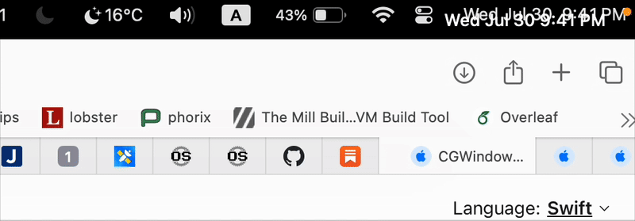

# Yet Another MacOS Clock App

Inspired by: [Corner Time](https://cornertime.app/en)

## QuickStart

- Copy the App under `AlwaysOnClock 2025-07-30 21-28-59` into your `Applications` folder.
- Add this app to the `login items` in systems setting

## Caveats

Some small bugs when supporting multiple monitors, but you know, this is free software
